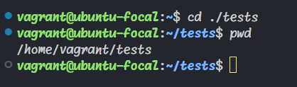
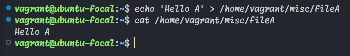

# Assignment

**My login name:** `vagrant`  
**My Home directory:** `/home/vagrant`

### Directory Structure (Subdirectories needed)

- `code`
- `tests`
- `personal`
- `misc`


## Tasks

### a. Navigate to the 'tests' directory using its absolute pathname.

```bash
cd /home/vagrant/tests
```


### b. Navigate to the 'tests' directory using its relative pathname.

```bash
cd tests
```


### c. Use the echo command to create a file named 'fileA' with the text content 'Hello A' in the 'misc' directory.

```bash
echo 'Hello A' > /home/vagrant/misc/fileA
```


### d. Create an empty file named 'fileB' in the 'misc' directory and then populate it with dummy content.

```bash
touch /home/vagrant/misc/fileB && echo "Lorem ipsum dolor sit amet, consectetur adipiscing elit. Vestibulum dapibus purus et augue fringilla, vel sollicitudin neque consequat. Nam vel justo non leo laoreet convallis." > /home/vagrant/misc/fileB
```


### e. Copy the contents of 'fileA' into a new file named 'fileC'.

```bash
cp /home/vagrant/misc/fileA /home/vagrant/misc/fileC
```


### f. Move the contents of 'fileB' into a new file named 'fileD'.

```bash
cp /home/vagrant/misc/fileB /home/vagrant/misc/fileD && echo -n > /home/vagrant/misc/fileB
```


### g. Create a tar archive called 'misc.tar' for the contents of the 'misc' directory.

```bash
tar -cf /home/vagrant/misc/misc.tar -C /home/vagrant/misc .
```


### h. Compress the tar archive to create a 'misc.tar.gz' file.

```bash
gzip /home/vagrant/misc/misc.tar
```


### i. Create a new user and enforce a password change upon their first login.

```bash
sudo useradd -m -s /bin/bash newuser && sudo passwd newuser && sudo passwd -e newuser
```


### j. Lock a user's password to prevent login access.

```bash
sudo passwd -l username
```


### k. Create a user with no login shell access.

```bash
sudo useradd -m -s /bin/false newuser
```


### l. Disable password-based authentication for SSH.

```bash
sudo sed -i 's/#PasswordAuthentication yes/PasswordAuthentication no/' /etc/ssh/sshd_config && sudo systemctl restart sshd
```

### m. Disable root login for SSH.

```bash
sudo sed -i 's/PermitRootLogin yes/PermitRootLogin no/' /etc/ssh/sshd_config && sudo systemctl restart sshd
```
